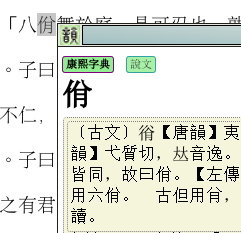
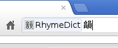

# 韻邇 - RhymeDictChrome

A chrome/chromium dictionary extension, which especially aims native Chinese speakers and Chinese learners, provides functionality of picking up words/characters from screen, searching directly from within the omnibox, holding offline dictionaries in rdbm format using browser's WebSql feature. It also provides user friendly management interface, and flexible customization mechanism. Some language related tools such as word counting, encoding conversion etc may be included in the upcoming versions as well.

## RhymeDict - 使用說明 - Help

### 簡介 - Introduction

RhymeDict 是一款特別針對漢語母語者和漢語學習者而編寫的Chrome辭典擴展。它的特色包括：

+ 屏幕取詞
+ Omnibox（智能地址欄）查詢
+ 同時支持在線搜索和本地查詢兩種模式的辭典（後者可離線使用）
+ 支持用戶自主擴充：按自身的需求安裝在線和本地辭典
+ 靈活方便的管理介面
+ ...

初版已將《康熙字典》和《海詞》（dict.cn:在線）集成在了擴展中。其他的免費辭書會陸添加到擴展專案的主頁，供下載安裝。另有一些語言文字相關的輔助工具，如：傳簡轉換、字數統計之類亦在計劃中，將在後續版本中實現。希望它能成為您網上衝浪得力的語言助手。

RhymeDict? is a dictionary extension for Chrome brower. It aims to be a highly extensible and handy widget so that the websurfers can consult their customized dictionary collection in a painless way. It supports picking up word on the screen and direct search from within the "omnibox". It also blah blah...

### 快捷鍵 - key shortcut

靠拖曳滑鼠選定（高亮）字或詞語，然後按下Alt + R 鍵(可自定義)，一個浮動視窗會立時彈出，顯示查詢的結果。

Use your mouse to select a word or a Chinese character (left-click, hold the button and drag the mouse, it got highlighted). Then, you press the keys Alt + R (you can customize the key-binding). A popup window will be opened immediately near the selection spot. The search result will be shown inside it.

### 智能地址欄 - Omnibox

按下Ctrl+L 組合鍵，選定omnibox（智能地址欄），也可以用滑鼠游標選定。在欄內輸入 rd + 空格，omnibox左端會顯現出「RhymeDict?」的標籤。接下來輸入欲查詢的字、詞，按下Enter，即可得出結果。

Press Ctrl+L to move the input caret into the omnibox, or use the mouse cursor to click it will do the same. Then input "rd" and one space, the label of "RhymeDict?" will show up. Then input the word or character your'd like to look, press enter to commit the search.

安裝本地辭典 - installation of local dictionary package

將下載的壓縮包解壓到某處，打開設置窗口－＞按下拾取文件的按鈕－＞在文件管理器中找到並選取剛剛解壓出的文件夾。確認。安裝機制會自行啟動。其進程會由提示小框實時通報給您。

Download the zip package from the project's home site, extract the contents (one folder) from the package, save them on an abitrary place in your file system. Open the options page, click the file chooser button, use the chooser to find and choose the afore extracted folder. The installation will begin automatically. And the progress will be updated through a small notification window.
